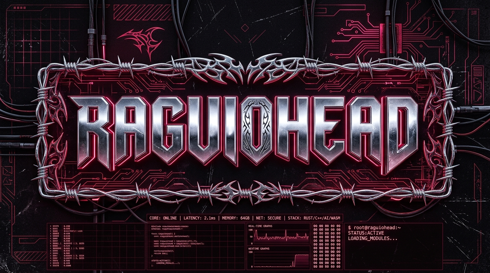

<div align="center">

<!-- HERO ART BANNER - CYBERTRIBAL CHROME & NEON WINE RED -->
<a href="https://linkedin.com/in/devguilhermep/">
  
</a>

<br><br>

<!-- BADGES DE NAVEGAÇÃO -->
<a href="https://linkedin.com/in/devguilhermep/">
  
</a>
<a href="https://github.com/raguiohead">
  
</a>
<a href="mailto:guilherme2016ae@gmail.com">
  
</a>

</div>

---

```text
╭─────────────────────────────────────────────────────────────╮
│ RAGUIOHEAD.SYS // PROFILE DATA                              │
├─────────────────────────────────────────────────────────────┤
│ Type ...... : Software Engineer & Systems Builder           │
│ Name ...... : Guilherme Pereira (Alves)                     │
│ Alias ..... : raguiohead                                    │
│ Role ...... : Full Stack & AI Systems Engineer              │
│ Domain .... : Inovações & Eficiência Operacional            │
│ Company ... : Unimed Ceará                                  │
│ OS ........ : Linux & Windows                               │
│ Location .. : Fortaleza, CE — Brazil                        │
│ Status .... : ONLINE // BUILDING IN PRODUCTION              │
╰─────────────────────────────────────────────────────────────╯
```

## ⚡ // WHO_AM_I

Engenheiro de Software atuando no time de **Inovações & Serviços Gerais da Unimed Ceará**.

Minha diretriz de desenvolvimento é **construir sistemas de alto ROI**: transformar processos manuais, regras de negócio complexas e gargalos operacionais em soluções escaláveis, seguras e fáceis de manter.

Atuo desde a modelagem de bancos relacionais de missão crítica até interfaces responsivas de alta produtividade, combinando **Clean Architecture, segurança corporativa (Keycloak RBAC), observabilidade e suítes de testes rigorosas** com a vanguarda de **Sistemas Multiagentes e RAG local de alta performance**.

---

## 🚀 // HIGHLIGHTS & IMPACTO

### 🏥 [Case Corporativo] Sistema de Reservas & Saúde Corporativa
> **Stack:** Java 21 · Spring Boot 3 · Oracle Database · Keycloak RBAC · Vue 3 Quasar  
- **Impacto:** Plataforma corporativa para agendamento de massoterapia e serviços de saúde ocupacional. Gestão 100% automatizada, zero concorrência/colisão em agendamentos simultâneos e Quality Gate A no SonarQube.  
- **Status:** `PRODUCTION // LIVE NA UNIMED CEARÁ`

### 🤖 [Case Corporativo] Service Desk IA & Triagem Semântica
> **Stack:** Next.js · TypeScript · Ollama (DeepSeek & Qwen) · SQLite WAL  
- **Impacto:** Assistente semântico com busca vetorial em base histórica de **6.500+ chamados**, com inferência contextual e recomendação em **<5ms**.  
- **Status:** `STAGING // EM REFINAMENTO`

### 📞 [Case Corporativo] Central de Contatos Colaborativa
> **Stack:** Spring Boot Modular · Hibernate JPA · Vue 3 Quasar · TypeScript  
- **Impacto:** Módulo institucional de diretório e inteligência PABX. Consultas otimizadas com JPQL imutável, eliminação de gargalos N+1 e consulta em tempo real.  
- **Status:** `PRODUCTION // INTEGRATED`

### 🧠 [Open Source] Senior AI Dev Workflow
> **Stack:** Markdown · Spec-Driven Development · AI Governance  
- **Impacto:** Especificação e guardrails para pareamento de engenharia com agentes autônomos e LLMs em ambientes de produção.  
- **Status:** `OPEN SOURCE // ACTIVE`

---

## 🛠️ // LOADOUT & TECH STACK

### 💻 BACKEND & ARQUITETURA

<p>
  
  
  
  
  
</p>

### 🎨 FRONTEND & EXPERIÊNCIA

<p>
  
  
  
  
  
</p>

### 🗄️ BANCO DE DADOS & PERSISTÊNCIA

<p>
  
  
  
  
</p>

### 🤖 IA, TESTES & DEVOPS

<p>
  
  
  
  
  
  
</p>

---

## 💬 // GREETS

```text
RAGUIOHEAD GREETS

CLEAN ARCHITECTURE · OPEN SOURCE · TDD & DDD
SECOND BRAIN (ZETTELKASTEN / OBSIDIAN) · LINUX
AND EVERYONE BUILDING SOFTWARE THAT GENERATES REAL VALUE
```

## 📡 // TRANSMISSION

<p>
  <a href="https://linkedin.com/in/devguilhermep/">
    
  </a>
  <a href="https://github.com/raguiohead">
    
  </a>
  <a href="mailto:guilherme2016ae@gmail.com">
    
  </a>
</p>

```text
──────────────────────────────────────────────────────────────

                 SOLVING PROBLEMS WITH PRECISION.
                   BUILDING SYSTEMS WITH ROI.

                     RAGUIOHEAD // 2026

──────────────────────────────────────────────────────────────
```
